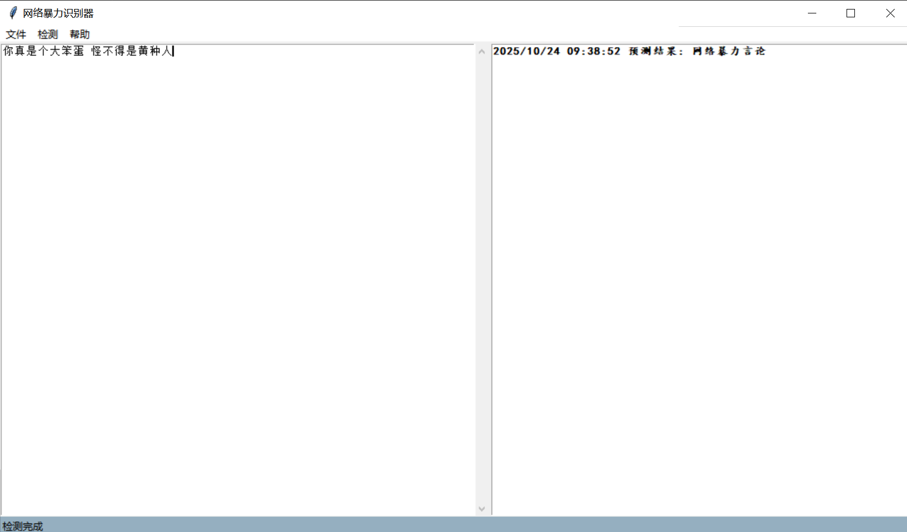

# CyberBully Detector
This repository implements a simple Chinese *cyber‑bullying text classifier* based on TF–IDF features and a multinomial Naïve Bayes model. It includes scripts to prepare a dataset, train a model, evaluate its performance, and a small Tkinter GUI for interactive prediction.

  

## Features
- **Data preparation** – DataPrepare.py reads a CSV/Excel file with a TEXT column and a label column (0 = normal, 1 = cyber bullying), cleans the text with jieba word segmentation and splits it into train/test sets. Progress is displayed and the processed data are cached in temp/*.pkl so that subsequent runs are fast.
- **Training** – TrainModel.py uses a TfidfVectorizer (optionally with bigrams) and a MultinomialNB classifier to learn from the processed data. It prints the number of features and training accuracy/F1 and saves the trained vectorizer and classifier into the model/ directory.
- **Evaluation** – Running TrainModel.py with the --evaluate flag loads the model and prints test accuracy, weighted F1 and a detailed classification report.
- **Prediction API** – CyberBullyRecognizer.py loads the saved vectorizer and classifier, segments incoming text with jieba, vectorizes it and returns a human‑readable prediction. The class defaults to mapping 0→正常言论 (normal speech) and 1→网络暴力言论 (cyber bullying).
- **Graphical UI** – App.py launches a simple Tkinter window (MainFrame) where you can paste text and click *检测* to see the predicted category. The menu bar and status bar are handled by TopMenu.py and StatBar.py respectively.
## Installation
# clone or copy this repository  
 ```bash
cd /path/to/CyberBullyDetector
 ```
# create and activate a Python 3.8+ virtual environment (optional)  
 ```bash
python -m venv .venv  
source .venv/bin/activate  # on Windows: .venv\Scripts\activate
 ``` 
# install dependencies  
 ```bash
pip install jieba pandas scikit-learn tqdm joblib
 ```
## Usage
- **Prepare your dataset.** Create a CSV file (e.g. CyberBully.csv) with two columns: TEXT (Chinese sentences) and label (0 or 1). Larger datasets improve accuracy.
- **Pre‑process the data.** Run:
```bash  
python DataPrepare.py --csv CyberBully.csv --text-col TEXT --label-col label --test-size 0.1
 ```
The script will split the data into training and test sets, perform word segmentation and save them to temp/处理训练集.pkl and temp/处理测试集.pkl.
- **Train the classifier.** Train a TF–IDF Naïve Bayes model with bigrams (optional) and save it to the model/ directory:

```bash  
python TrainModel.py --max-features 200000 --ngram-max 2 --alpha 0.05
```
- **Evaluate (optional).** See how the model performs on the test set:
```bash  
python TrainModel.py --evaluate
```
- **Launch the GUI.** Interactively classify new sentences:
python App.py


## Notes
- The default model is a simple baseline; you can experiment with max-features, ngram-max and alpha to improve performance.
- Stopwords can be provided via a text file passed to --stopwords.
- This codebase is intended for educational/demonstration purposes.
