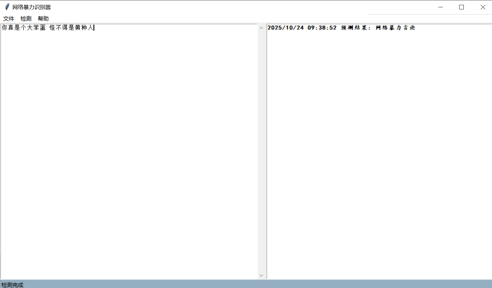

````markdown
# CyberBully Detector

A simple Chinese cyberbullying text classifier based on TF–IDF features and a Multinomial Naïve Bayes model. The repo includes scripts for data preparation, model training/evaluation, and a small Tkinter GUI for interactive prediction.



---

## Main files

- `DataPrepare.py` – Load a CSV/Excel file, clean and segment text (jieba), split into train/test, and cache processed data.
- `TrainModel.py` – Train a TF–IDF + Naïve Bayes classifier and save the vectorizer/model.
- `CyberBullyRecognizer.py` – Load the saved model and classify new input text.
- `App.py` – Tkinter GUI: paste a sentence, click a button, and see the predicted category.
- `TopMenu.py`, `StatBar.py` – Menu bar and status bar for the GUI.

---

## Installation

```bash
cd /path/to/CyberBullyDetector

# (optional) create and activate a virtual environment
python -m venv .venv
# Windows:
.venv\Scripts\activate
# macOS / Linux:
source .venv/bin/activate

# install dependencies
pip install jieba pandas scikit-learn tqdm joblib
````

---

## Basic usage

1. **Prepare your dataset**

   Create a CSV file (e.g., `CyberBully.csv`) with two columns:

   * `TEXT` – Chinese sentences
   * `label` – 0 (normal) or 1 (cyberbullying)

2. **Preprocess and split**

   ```bash
   python DataPrepare.py --csv CyberBully.csv --text-col TEXT --label-col label --test-size 0.1
   ```

3. **Train the model**

   ```bash
   python TrainModel.py
   ```

4. **(Optional) Evaluate on the test set**

   ```bash
   python TrainModel.py --evaluate
   ```

5. **Launch the GUI**

   ```bash
   python App.py
   ```

Then paste text into the window and click the button to see the prediction.

```
::contentReference[oaicite:0]{index=0}
```
